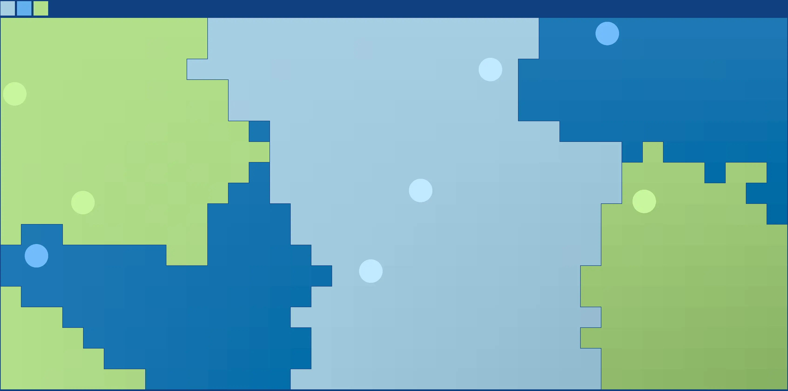

# Pong

预览地址 <https://zhengkai.github.io/pong/>

学习 C++ 的练手项目，灵感来自于 [vnglst/pong-wars](https://github.com/vnglst/pong-wars)，并扩展成任意数量的球和区

由于一切都在学习中，有些实现看起来非常蠢。没搞明白如何 wasm 下编译 sdl3 ttf，所以 web 版没有操作提示文字

方向键可以调整速度，空格键可以切换是否显示球体

基于 [box2d](https://box2d.org/)、[SDL3](https://wiki.libsdl.org/SDL3/FrontPage)，使用了 [cmake](https://cmake.org/) 和 [vcpkg](https://vcpkg.io/) 进行构建和依赖管理。在 linxu 和 wasm 上编译通过
